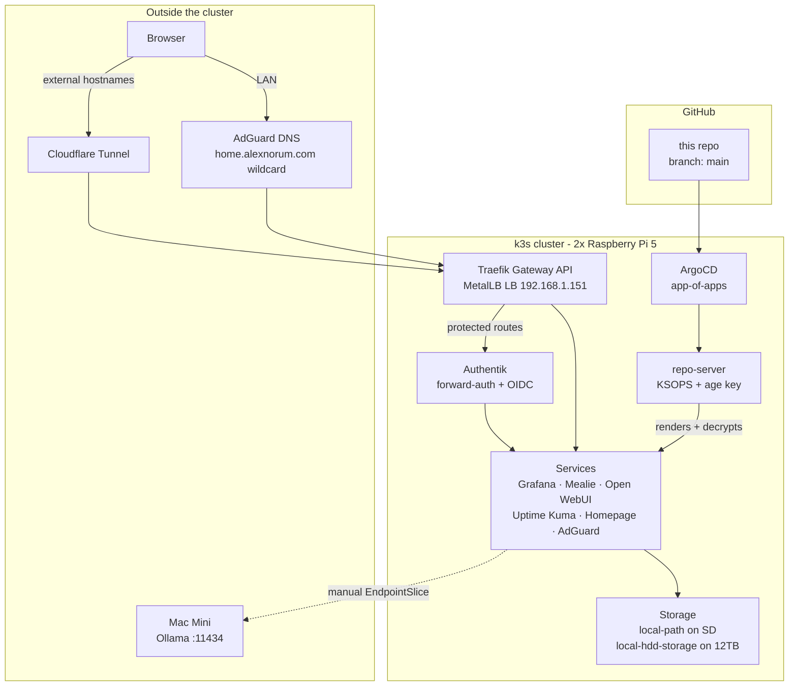

# Home Lab Kubernetes Cluster

[](https://github.com/anorum/homelab/actions/workflows/security.yml)

A k3s cluster running on two Raspberry Pi 5s, managed entirely through GitOps. Everything is declared here — push to `main` and ArgoCD reconciles the cluster. Secrets are committed encrypted with SOPS + age and decrypted inside the ArgoCD repo-server at render time.

See [CLAUDE.md](CLAUDE.md) for the detailed architecture reference.

## Architecture



Two routes in: Cloudflare Tunnel for the handful of externally reachable hostnames, and AdGuard's wildcard DNS for everything on the LAN. Both land on the same Traefik Gateway. Routes that need auth get an Authentik forward-auth middleware; Grafana, ArgoCD and Open WebUI additionally use Authentik as an OIDC provider.

All HTTP routing uses Gateway API `HTTPRoute` against a single `homelab-gateway` — not Ingress.

## Components

**Infrastructure**
- **k3s** `v1.34.4+k3s1` — 2 nodes, one control plane
- **MetalLB** — L2 load balancer, Traefik at `192.168.1.151`
- **Traefik** — Gateway API provider
- **Cloudflared** — outbound tunnel; no inbound ports are opened
- **ArgoCD** — app-of-apps, auto-sync with `prune` and `selfHeal`
- **SOPS + age + KSOPS** — encrypted secrets rendered at sync time
- **Renovate** — automated dependency updates, patch images auto-merged
- **Terragrunt + OpenTofu** — AWS IAM for the backup user, state in S3
- **Ansible** — node bootstrap, k3s install, Tailscale subnet router

**Applications**
- **Prometheus + Grafana + Alertmanager** — metrics and Discord alerting, custom rules in `prometheus/homelab-rules.yaml`
- **Loki + Promtail** — log aggregation, 14d retention on the HDD
- **Uptime Kuma** — external uptime checks
- **Authentik** — SSO/IdP, providers defined as blueprints in `authentik/`
- **AdGuard** — network-wide DNS filtering
- **Mealie** — recipes and meal planning
- **Ollama + Open WebUI** — local models; Ollama runs natively on a Mac Mini and is reached via a manual EndpointSlice
- **Homepage** — service dashboard
- **Home Assistant** — running in-cluster at `ha.home.alexnorum.com`, but not yet declared here; it predates the app-of-apps layout and is still managed by hand (see Roadmap)

## Repository layout

```
adguard/       authentik/     backup/        cloudflared/
homepage/      loki/          mealie/        metallb/
ollama/        open-webui/    prometheus/    reloader/
traefik/       uptime-kuma/                  # one directory per service
argo-apps/     # ArgoCD Application definitions (app-of-apps)
argo-cd/       # ArgoCD config: OIDC, RBAC, KSOPS patch
ansible/       # node bootstrap, k3s install, Tailscale
storage/       # StorageClass + 11Ti PV for the 12TB HDD
terraform/     # Terragrunt + OpenTofu (AWS IAM for backups)
mac-mini/      # LaunchAgents and compose for the external Mac Mini
scripts/       # bootstrap and utility scripts
docs/          # disaster recovery, postmortems
not_in_use/    # deprecated configs kept for reference
```

Each service directory follows the same shape: `kustomization.yaml`, `namespace.yaml`, workload, `service.yaml`, plus `httproute.yaml` if it's web-facing and `*-secret-generator.yaml` + `*.enc.yaml` if it needs secrets. Helm charts are inlined under `helmCharts:` in `kustomization.yaml` rather than managed as separate releases.

## Bootstrap

Node preparation and k3s install are handled by Ansible:

```bash
ansible-playbook -i ansible/inventory/hosts.yaml ansible/playbook/install-k3s.yaml
ansible-playbook -i ansible/inventory/hosts.yaml ansible/playbook/deploy-cloudflared.yaml
```

Then bring up the cluster itself — MetalLB, Traefik, storage, ArgoCD, apps, and secrets, in that order:

```bash
./scripts/bootstrap-cluster.sh
```

ArgoCD takes over from there and syncs everything else from `main`. Full rebuild procedures, including restoring stateful data from S3, are in [docs/disaster-recovery.md](docs/disaster-recovery.md).

## Operations

**Adding a service** — create the directory with a `kustomization.yaml` and `namespace.yaml`, add an `httproute.yaml` pointing at `homelab-gateway` in the `traefik` namespace if it's web-facing, add an entry to `argo-apps/applications.yaml`, and push. ArgoCD picks it up within a few minutes.

**Secrets** — anything sensitive is committed encrypted:

```bash
sops -e secret.yaml > secret.enc.yaml   # create
sops secret.enc.yaml                    # edit in place
```

The `*.enc.yaml` suffix is load-bearing: it's what `.sops.yaml` matches on, and what the KSOPS generators reference. CI fails if one of those files isn't actually encrypted.

**Exposing something outside the cluster** — headless Service plus a manual EndpointSlice; `ollama/service.yaml` is the reference. Note that ArgoCD's default `resource.exclusions` covers EndpointSlice, so it will report `Synced` without ever applying that file — after changing an external IP you have to `kubectl apply -f <service>/service.yaml` yourself.

## Documentation

- [docs/disaster-recovery.md](docs/disaster-recovery.md) — recovery scenarios and backup strategy
- [docs/postmortems/](docs/postmortems/) — incident write-ups

## Security

- No inbound ports. External access is via Cloudflare Tunnel only; Tailscale subnet routers on both Pis cover remote admin.
- Secrets are encrypted with SOPS + age before they are committed. The repo is public, so this is enforced rather than assumed — the [security workflow](.github/workflows/security.yml) runs gitleaks across full history and fails if any `*.enc.yaml` is missing its `sops:` block or a plaintext Secret manifest appears outside the convention.
- Authentik provides SSO across services, with forward-auth on the sensitive ones.
- The age private key lives only on the ArgoCD repo-server and offline backup — never in this repo.

## Roadmap

- [x] Monitoring dashboards (Grafana + kube-prometheus-stack)
- [x] Alerting (Alertmanager → Discord, custom homelab rules)
- [x] Disaster recovery documentation
- [x] Automated backups (S3 CronJob, Terragrunt-managed IAM)
- [x] Tailscale remote access
- [x] Local AI voice assistant (Home Assistant + Ollama + Wyoming)
- [x] Voice satellite hardware (Pi 4B + ReSpeaker)
- [x] Renovate for automated dependency updates
- [x] Secret scanning in CI
- [ ] Network policies
- [ ] Back up the remaining `local-path` PVCs (Uptime Kuma, AdGuard, Grafana)
- [ ] Bring the in-cluster Home Assistant under ArgoCD management
- [ ] HomeKit bridge for Siri device control
- [ ] Personal AI agent service (PydanticAI + tool registry)
